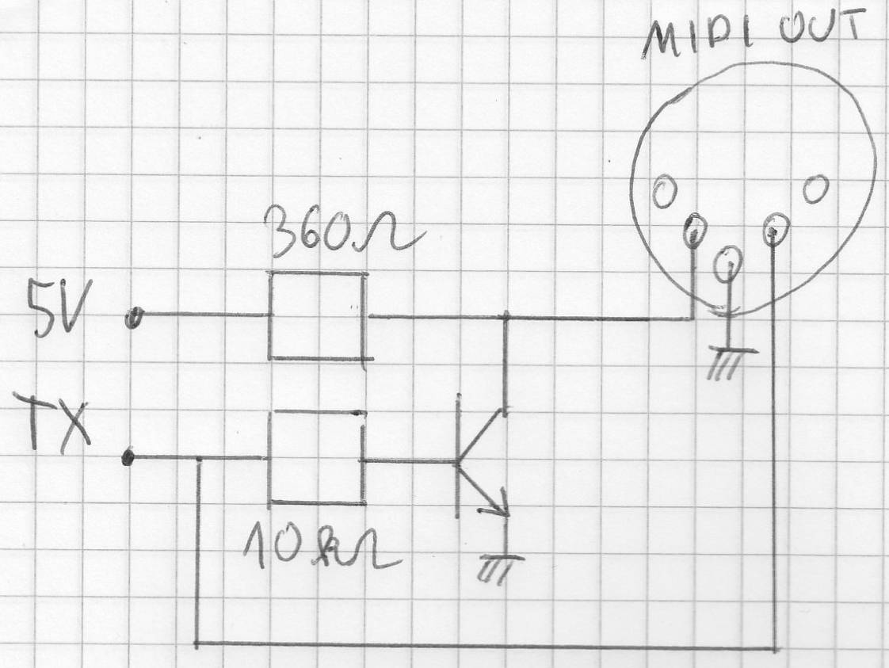
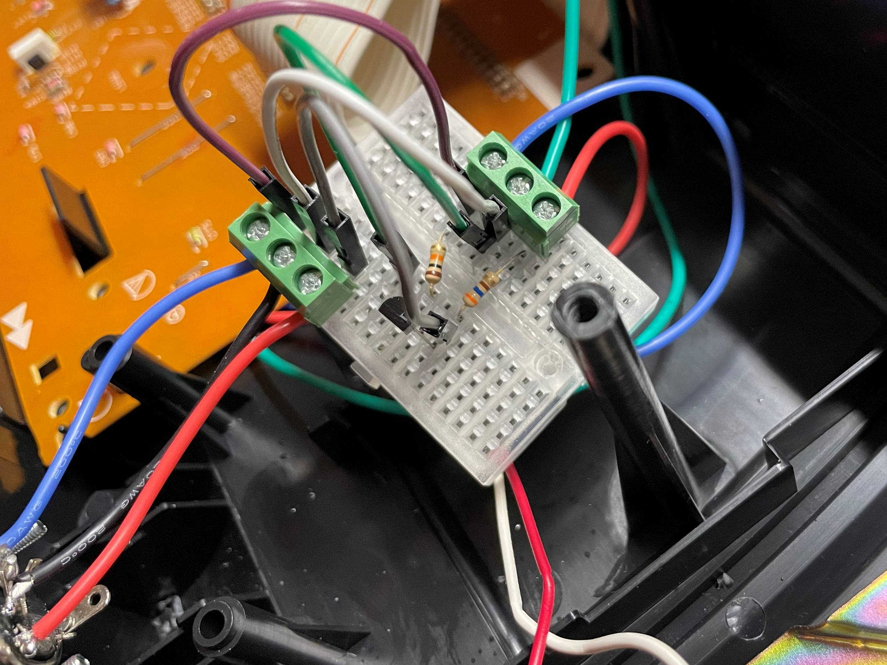
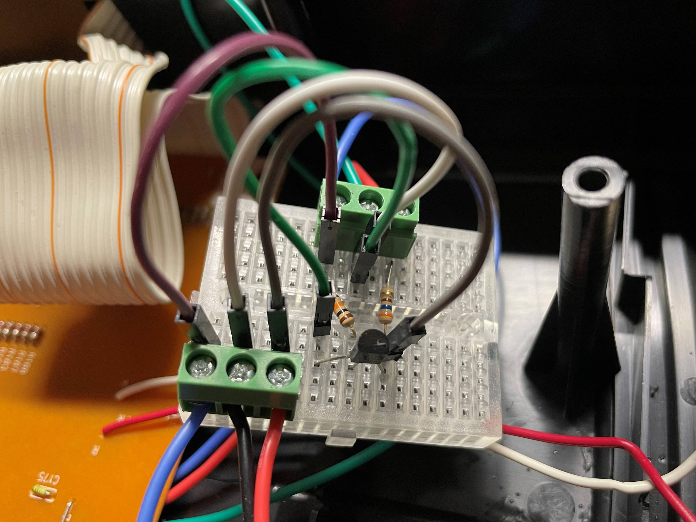

# Add midi to Casio CTK-480
Based on project https://hackaday.io/project/28644-add-midi-to-casio-ctk-480 by [stephengeorgewest](https://github.com/stephengeorgewest)

* Red wire : 5V
* Green wire : Ground
* Blue wire : TX

* NPN transistor : 2N2222

Works with Synthesia and [iConnectivity mio](https://www.iconnectivity.com/products/midi/mio). Remember to connect the `MIDI IN` to the keyboard and not the `MIDI OUT`.

